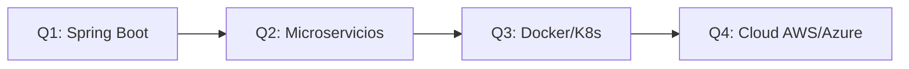

# 👋 ¡Hola! Soy Rubén Juan

<div align="center">


**Backend Developer en formación | Estudiante de 2º DAM**

*Construyendo aplicaciones desde cero, entendiendo cómo funcionan por dentro*

</div>

---

## 🚀 Sobre mí

```java
public class Ruben {
    private String rol = "Backend Developer en formación";
    private String educacion = "2º DAM (Desarrollo de Aplicaciones Multiplataforma)";
    private String[] intereses = {"Backend", "Bases de datos", "Sistemas", "Arquitectura software"};
    
    public String getMision() {
        return "Convertirme en desarrollador backend profesional " +
               "y trabajar en proyectos reales con impacto";
    }
    
    public boolean siempreAprendiendo() {
        return true; // ✨
    }
}
```

💻 **Enfocado en:** Backend development, bases de datos relacionales, APIs REST  
🔍 **Me motiva:** Entender cómo funcionan las cosas por dentro y resolver problemas reales  
🔧 **Base sólida en:** Sistemas, redes y arquitectura de software  

---

## 🛠️ Stack Tecnológico

### Backend & Databases
```
☕ Java              ████████████████████ 90%
🌱 Spring Boot       ██████████░░░░░░░░░░ 50%
🗄️ MySQL / MariaDB   ███████████████░░░░░ 75%
🔐 SQLite            ████████████████████ 95%
```

### Frontend & Mobile
```
📱 Android (Java)    ████████████████░░░░ 80%
⚛️ React.js          ████████░░░░░░░░░░░░ 40%
🎨 HTML/CSS/JS       ██████████████░░░░░░ 70%
```

### Herramientas & Sistemas
```
🔧 Git & GitHub      ████████████████░░░░ 80%
🐧 Linux             ████████████░░░░░░░░ 60%
🌐 Redes             ███████████░░░░░░░░░ 55%
📊 Maven / Gradle    ██████████░░░░░░░░░░ 50%
```

---

## 📂 Proyectos Destacados

### 🎬 [Filmoteca - Gestión de Películas](https://github.com/ruubeenn13/filmoteca-RubenJuan)
> Aplicación Android completa para gestionar colecciones de películas

**Stack:** `Java` `Android` `SQLite` `Material Design`

**Features:**
- ✅ Sistema de autenticación (login/registro)
- ✅ CRUD completo con SQLite
- ✅ SharedPreferences para configuración
- ✅ Reproducción multimedia con MediaPlayer
- ✅ Notificaciones locales
- ✅ Menús contextuales y navegación avanzada

**Aprendizajes clave:** Arquitectura Android, persistencia de datos, ciclo de vida de actividades

---

### 🍽️ [La Marmita - Web para Cliente](https://www.lamarmitaparallevar.com)
> Sitio web completo desarrollado para un restaurante de comida para llevar

**Stack:** `HTML` `CSS` `JavaScript` `Responsive Design`

**Features:**
- ✅ Diseño responsive adaptado a móvil y desktop
- ✅ Optimización SEO para búsquedas locales
- ✅ Desplegado en producción con dominio propio
- ✅ Menú interactivo y formulario de contacto
- ✅ Optimización de rendimiento y carga rápida

**Aprendizajes clave:** Trabajo con cliente real, deployment, hosting, diseño responsive, experiencia de usuario

---

### ⚛️ [Aprendiendo React](https://github.com/ruubeenn13/aprendiendo_react)
> Repositorio de aprendizaje con proyectos prácticos de React

**Stack:** `React` `Vite` `JavaScript` `CSS`

**Proyectos incluidos:**
- 🎮 Tic Tac Toe - Juego interactivo con lógica de estado
- 🖱️ Mouse Follower - useEffect y event listeners
- 📊 Monitor Solar - Dashboard con componentes reutilizables

**Aprendizajes clave:** Hooks (useState, useEffect), componentes, props, cleanup functions

---

## 🎯 En qué estoy trabajando ahora

### 📚 Aprendiendo
- Spring Boot - APIs REST y arquitectura backend
- JPA/Hibernate - ORM y persistencia de datos
- Buenas prácticas - Clean Code, SOLID, patrones de diseño
- Testing - JUnit, pruebas unitarias

### 🔨 Construyendo
- API REST con Spring Boot (próximamente)
- Aplicación full-stack Java + React
- Mejorando proyectos existentes

---

## 📊 GitHub Stats

<div align="center">


</div>

---

## 🎓 Formación

**📖 2º DAM - Desarrollo de Aplicaciones Multiplataforma**
- Programación Multimedia y Dispositivos Móviles
- Acceso a Datos
- Programación de Servicios y Procesos
- Sistemas de Gestión Empresarial

**💡 Áreas de interés:**
- Arquitectura de software backend
- Diseño de bases de datos relacionales
- APIs RESTful y microservicios
- Optimización y escalabilidad

---

## 🌱 Roadmap de Aprendizaje 2026



### Q1 2026 (Actual)
- [x] Fundamentos de Spring Boot
- [x] APIs REST básicas
- [ ] Spring Data JPA
- [ ] Spring Security

### Q2 2026
- [ ] Arquitectura de microservicios
- [ ] Mensajería (RabbitMQ/Kafka)
- [ ] Testing avanzado
- [ ] Documentación con Swagger

### Q3 2026
- [ ] Docker y contenedores
- [ ] Kubernetes básico
- [ ] CI/CD pipelines
- [ ] Monitoreo y logging

### Q4 2026
- [ ] Cloud (AWS o Azure)
- [ ] Escalabilidad y performance
- [ ] Patrones de diseño avanzados
- [ ] Proyecto full-stack completo

---

## 💼 Habilidades Blandas

🧩 **Resolución de problemas** - Me gusta entender la raíz del problema  
📖 **Aprendizaje continuo** - Siempre investigando y probando nuevas tecnologías  
🤝 **Trabajo en equipo** - Colaboración en proyectos académicos y personales  
📝 **Documentación** - Creo READMEs detallados y código autodocumentado  

---

## 📫 Contacto

<div align="center">

[](https://github.com/ruubeenn13)

**📧 Abierto a colaboraciones y oportunidades de aprendizaje**

</div>

---

## ⚡ Fun Facts

```javascript
const ruben = {
    code: "Desde las 9 AM hasta tarde",
    learn: "Documentación oficial > tutoriales",
    debug: "console.log() es mi mejor amigo",
    motto: "Si funciona, no lo toques... mentira, siempre se puede mejorar 😄"
};
```

---

<div align="center">

### 💡 "El código limpio siempre parece que fue escrito por alguien a quien le importa"

**Última actualización:** Marzo 2026

⭐ Si te gusta algún proyecto, ¡dale una estrella! ⭐

</div>
